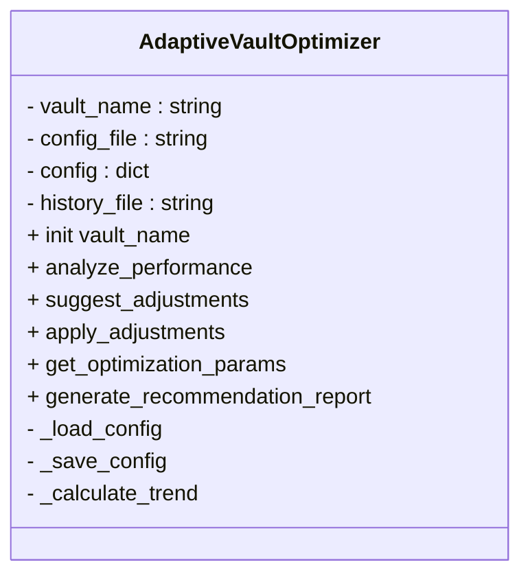

# AdaptiveVaultOptimizer

AdaptiveVaultOptimizer is a Python class designed to **dynamically tune** the vault-optimization parameters in the Fallout Shelter Efficiency program. It analyzes recorded performance metrics over time and adjusts settings so that the “with outfits” optimization always outperforms the initial placement. 

## 🚀 Purpose and Context
AdaptiveVaultOptimizer sits between the performance tracker and the placement algorithm:
- It reads historical cycle data captured by `VaultPerformanceTracker`.  
- It produces parameter suggestions for `placementCalc.run()`.  
- It writes back to a JSON configuration for future runs.  

In the command-line interface (`fallShel_efficiency_program.py`), it is instantiated and invoked every few cycles to keep optimization effective . It also underpins GUI automation in `fallout_gui.py` via a background thread .

## 🛠 Configuration and Initialization
Upon creation, the optimizer:
1. Stores the vault identifier (e.g., `"vault1"`).  
2. Loads or initializes a JSON config named `<vault>_optimizer_config.json`.  
3. Prepares to read `<vault>_performance_history.json` for analysis.  

```python
optimizer = AdaptiveVaultOptimizer("vault1")
# Internally:
# self.config_file  → "vault1_optimizer_config.json"
# self.history_file → "vault1_performance_history.json"
```

## 📊 Performance Analysis
`analyze_performance()` examines the last N cycles (default **10**):
- Loads timestamps and four metrics:  
  - `initial`  
  - `before_balance`  
  - `after_balance`  
  - `with_outfits`  
- Computes **averages** and **linear trends** (slope) for each.  
- Determines whether “with outfits” beats the other stages.  
- Calculates **gaps** between “with outfits” and each baseline.  

Key steps:
- Read history file, bail if <2 data points.  
- Slice the last `performance_window` entries.  
- Use NumPy to compute means and trend slopes.  
- Return a dict of metrics, flags, and gaps. 

## 🎯 Suggesting Adjustments
Based on analysis, `suggest_adjustments()`:
- Flags **issues** if:
  - “With outfits” does not beat the **initial** state.  
  - It does not beat the **before-balance** state.  
  - The **trend** of “with outfits” is degrading.  
- Recommends **parameter tweaks** such as:  
  - Increasing `swap_aggressiveness`  
  - Tightening `balance_threshold`  
  - Raising `max_balance_passes` or `min_stat_threshold`  
  - Switching `outfit_strategy`  
- Provides **reasoning** for each suggestion.  

```python
suggestions = optimizer.suggest_adjustments()
if suggestions:
    print("🔧 Suggested Adjustments:", suggestions['adjustments'])
```

## ⚙️ Applying Adjustments
`apply_adjustments(auto_apply=False)` prompts the user (unless `auto_apply=True`) and:
1. Applies suggested tweaks into `self.config`.  
2. Saves the updated JSON config.  
3. Returns `True` if changes were saved, else `False`.  

This allows both **interactive** and **hands-off** tuning in continuous runs. 

## 🔑 Retrieving Optimization Params
Before each cycle, the placement algorithm fetches current parameters:

```python
params = optimizer.get_optimization_params()
# {
#   'BALANCE_THRESHOLD': 5.0,
#   'MAX_PASSES': 10,
#   'SWAP_AGGRESSIVENESS': 1.0,
#   'MIN_STAT_THRESHOLD': 5,
#   'OUTFIT_STRATEGY': 'deficit_first'
# }
```

These map directly to the JSON config keys. 

## 📝 Generating Recommendation Reports
`generate_recommendation_report()` prints a detailed summary:
- **Current averages** and **trends** for all stages.  
- **Goal achievement** indicators (✓/✗).  
- **Current config values** for all parameters.  

It offers a human-readable deep dive at the end of a session. 

## Configuration Parameters Reference

| Parameter             | Default      | Description                                                      |
|-----------------------|--------------|------------------------------------------------------------------|
| balance_threshold     | 5.0          | How close rooms need to be to target                              |
| max_balance_passes    | 10           | Maximum balance passes (capped at 25)                             |
| outfit_strategy       | deficit_first | Strategy for outfit assignment (`deficit_first` or `big_rooms_first`, can switch to `hybrid`) |
| swap_aggressiveness   | 1.0          | Degree of willingness to swap dwellers (range 0.5–5.0)            |
| min_stat_threshold    | 5            | Minimum stat value to consider a dweller for room placement       |
| learning_rate         | 0.1          | Speed at which parameters adjust over time                        |
| performance_window    | 10           | Number of recent cycles to analyze                                |
| target_improvement    | 0.05         | Minimum percent improvement required (e.g., 5%)                   |

## Class Structure Diagram
A high-level view of the class and its members:



This diagram highlights the **public API** methods versus internal helpers, showing how AdaptiveVaultOptimizer manages its configuration and history.