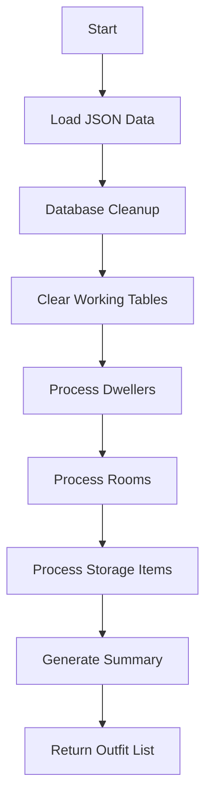

# TableSorter.py

**Location:** `fallShel_efficiency-program/TableSorter.py`  
**Role:** Processes decrypted vault JSON, updates a local SQLite database, and summarizes dwellers, rooms, and storage items for downstream modules. 

## Overview
TableSorter parses a vault export JSON file,  
cleans up stale database entries,  
and populates working tables reflecting current vault state.  
It returns a list of outfit IDs for use by optimization routines.

## 🚀 Key Features
- **Automatic Cleanup:** Removes dwellers deleted in the game from the database  
- **Data Ingestion:** Reads dwellers, rooms, and storage items from JSON  
- **Database Population:**  
  - SPECIAL stats (`Stats` table)  
  - Dweller core info (`dwellers` table)  
  - Room assignments (`ProductionRoom`, `CraftingRoom`, etc.)  
- **Storage Tracking:** Counts weapons, outfits, and junk  
- **Summary Reporting:** Prints console summaries and returns outfit list  

## Dependencies
- Python Standard Library: `os`, `json`, `sqlite3`, `subprocess`, `time`  
- Third-party: `pyodbc` 

## Imported By
| Module                       | Context                                    |
|------------------------------|--------------------------------------------|
| `fallShel_efficiency_program.py` | Main program cycle (`run_cycle`)        |
| `fallout_gui.py`            | Optimization thread workflows   |

---

## Functions

### print_section(title, char="=")
Prints a centered section header framed by a repeated character.
```python
def print_section(title, char="="):
    """Print a formatted section header"""
    width = 80
    print(f"\n{char * width}")
    print(f"{title.center(width)}")
    print(f"{char * width}\n")
```

### print_subsection(title)
Prints a left-aligned subsection divider.
```python
def print_subsection(title):
    """Print a formatted subsection header"""
    print(f"\n{'-' * 80}")
    print(f"  {title}")
    print(f"{'-' * 80}")
```

### run(json_path) → List[int]
Main entry point. Given the filename of a decrypted vault JSON (relative to `~/Downloads`), it:

1. **Connects to** `vault.db`  
2. **Loads** JSON into memory  
3. **Cleans up** dwellers deleted in the JSON  
4. **Clears** working tables: Stats, TrainingRoom, CraftingRoom, Non_ProductionRoom, ProductionRoom  
5. **Processes**  
   - **Dwellers:**  
     - Inserts/updates SPECIAL stats into `Stats`  
     - Inserts/updates core dweller data into `dwellers`  
     - Tracks currently equipped outfits and weapons  
   - **Rooms:**  
     - Calculates room size (`Small`, `Medium`, `Large`)  
     - Lists assigned dwellers  
     - Inserts into appropriate room table via **table_map**  
   - **Storage Items:**  
     - Counts weapons, outfits, and junk  
6. **Prints** detailed console logs and a final summary  
7. **Returns** the list of all outfit IDs encountered

```python
from TableSorter import run

outfit_list = run("vault1.json")
```

---

## Data Pipeline Flowchart



---

## Database Tables

### Working Tables Cleared
| Table Name           | Description                          |
|----------------------|--------------------------------------|
| Stats                | SPECIAL stats per dweller            |
| TrainingRoom         | Dwellers in training rooms           |
| CraftingRoom         | Dwellers in crafting rooms           |
| ProductionRoom       | Dwellers in production/consumable    |
| Non_ProductionRoom   | Rooms not involved in production     |

### Room Class Mapping
| Room Class  | Target Table     |
|-------------|------------------|
| Production  | ProductionRoom   |
| Consumable  | ProductionRoom   |
| Crafting    | CraftingRoom     |
| Training    | TrainingRoom     |
| *Others*    | Non_ProductionRoom |

### Room Size Map
| MergeLevel | Size   |
|------------|--------|
| 0          | Small  |
| 1          | Medium |
| 2          | Large  |

---

## Example Console Output

```
================================================================================
                              VAULT DATA PROCESSOR
================================================================================

Loading vault data from: /home/user/Downloads/vault1.json

--------------------------------------------------------------------------------
  Database Cleanup
--------------------------------------------------------------------------------
✓ Removed 1 deleted dweller(s) from database
✓ Cleared 5 working tables

================================================================================
                         PROCESSING DWELLERS
================================================================================
[1/45] Jane Doe
 ID: abc123
 Health: 75/100 | Level: 24 | Outfit: outfit_42
 SPECIAL: L: 5 | S: 7 | P: 4 | E: 9 | C: 3 | I: 6 | A: 8
 Assignment: Production
 Weapon: weapon_17
...
================================================================================
                         PROCESSING ROOMS
================================================================================
Production (Diner)
 Location: Row 2, Col 3
 Level: 2 | Size: Medium (Merge 1)
 Dwellers (3): Jane Doe, John Roe, ID xyz999 (missing)
...
================================================================================
                         PROCESSING STORAGE
================================================================================
Storage Items Summary:
 Weapons: 12
 Outfits: 8
 Junk: 25

================================================================================
                         PROCESSING COMPLETE
================================================================================
Summary:
 ✓ Processed 45 dwellers
 ✓ Processed 12 rooms
 ✓ Cleaned up 1 deleted dweller(s)

Room Distribution:
 Crafting: 3
 Production: 5
 Training: 4

Outfit Tracking:
 Total outfits (equipped + storage): 53
 Unique outfit types: 15

 Outfit IDs in use:
  outfit_01: 4x
  outfit_02: 3x
  ...
```

---

```card
{
  "title": "Database Prerequisite",
  "content": "Ensure vault.db exists with tables: Stats, dwellers, TrainingRoom, CraftingRoom, Non_ProductionRoom, ProductionRoom."
}
```

*End of Documentation*