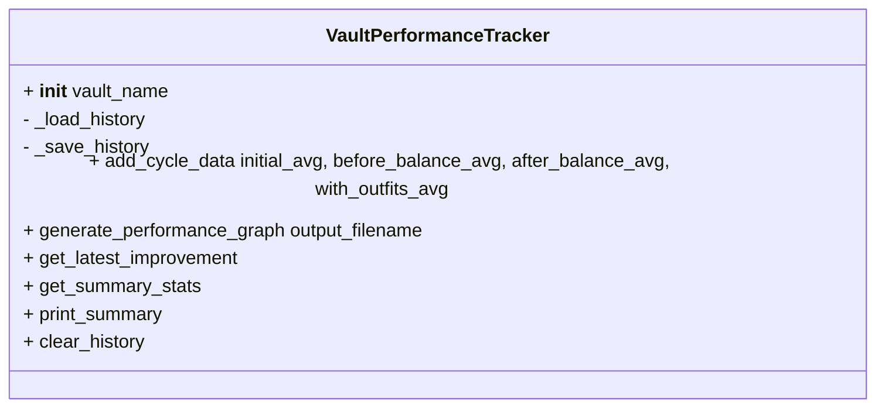

# VaultPerformanceTracker.py

**VaultPerformanceTracker** records and visualizes vault production performance over time. It persists cycle data to a JSON file, generates summary statistics, and creates performance graphs. This utility integrates into both CLI and GUI flows for Fallout Shelter efficiency analysis.

## Class: VaultPerformanceTracker

Initializes history storage and provides methods to record, analyze, and visualize performance data.

```python
from VaultPerformanceTracker import VaultPerformanceTracker

tracker = VaultPerformanceTracker("vault1")
```
**VaultPerformanceTracker** is imported by:
- **CLI main script** (`fallShel_efficiency_program.py`)   
- **Placement module** (`placementCalc.py`)   
- **GUI application** (`fallout_gui.py`)   



---

## Initialization

Creates a tracker tied to a vault name and loads existing history.

```python
def __init__(self, vault_name):
    self.vault_name = vault_name
    self.data_file = f"{vault_name}_performance_history.json"
    self.history = self._load_history()
```

- **vault_name**: Identifier (e.g., `"vault1"`)  
- **data_file**: JSON file path for persistence  
- Calls **_load_history** to initialize `self.history` 

---

## Private Methods

### _load_history  
Loads JSON history or initializes empty structure.

- Checks if `data_file` exists  
- On parse error, falls back to empty lists  

### _save_history  
Writes `self.history` back to JSON with indentation.

```python
def _save_history(self):
    """Save performance history to file"""
    with open(self.data_file, 'w') as f:
        json.dump(self.history, f, indent=2)
```

---

## Recording Data 📝

### add_cycle_data

Adds a new cycle’s average production times and saves immediately.

| Parameter            | Description                                   |
|----------------------|-----------------------------------------------|
| `initial_avg`        | Avg. time before any balancing                |
| `before_balance_avg` | Avg. time after balancing dwellers            |
| `after_balance_avg`  | Avg. time after applying load balancing       |
| `with_outfits_avg`   | Avg. time after equipping outfits             |

```python
tracker.add_cycle_data(12.5, 10.3, 9.8, 8.2)
```

- Appends ISO timestamp and metrics to history  
- Persists via `_save_history`  
- Prints confirmation with current datetime 

---

## Visualization 📊

### generate_performance_graph

Creates a multi-line time series graph showing performance trends.

```python
filename = tracker.generate_performance_graph()
# → "vault1_performance_timeline.png"
```

- Parses ISO timestamps into `datetime` objects  
- Plots four series with distinct markers and colors  
- Formats axes, legend, grid, and date labels  
- Saves PNG (defaults to `{vault_name}_performance_timeline.png`)  
- Returns saved filename and logs success 

---

## Analysis Methods

### get_latest_improvement

Computes the delta between the **initial** and **with_outfits** metrics of the latest cycle.

```python
impr = tracker.get_latest_improvement()
# {
#   'initial': 12.5,
#   'final': 8.2,
#   'improvement_seconds': 4.3,
#   'improvement_percent': 34.4
# }
```

Returns `None` if no data exists .

### get_summary_stats

Aggregates statistics across all cycles:

- Total cycles
- Average **initial** and **with_outfits** times
- Best/worst optimized performance
- First & last record timestamps

Returns `None` if history is empty .

---

## Console Summary

### print_summary

Displays a formatted report:

```bash
============================================================
VAULT PERFORMANCE SUMMARY: vault1
============================================================
Total Cycles Recorded: 5
First Recorded: 2024-07-01 12:00:00
Last Recorded: 2024-07-01 12:05:00

Average Performance:
  Initial State: 12.50s
  Optimized State:  8.20s
  Best Performance:  7.90s
  Worst Performance: 10.30s

Latest Cycle Improvement:
 12.50s →  8.20s
 Improvement:  4.30s (34.40%)
============================================================
```

- Leverages **get_summary_stats** and **get_latest_improvement**  
- Prints clear section separators and bold labels 

---

## Data Management

### clear_history 🗑️

Resets all recorded data in memory.

```python
tracker.clear_history()
# ✓ Cleared all history for vault1
```

- Empties `self.history` lists  
- Does **not** delete the JSON file on disk 

---

## Integration Context

- **CLI Flow** (`fallShel_efficiency_program.py`): Records each cycle after optimization and prints timeline at exit .  
- **Placement Module** (`placementCalc.py`): Appends performance after generating optimization results .  
- **GUI** (`fallout_gui.py`): Updates charts and final report panels using summary data .

This cohesive design ensures vault performance is tracked consistently, enabling both automated scripts and interactive interfaces to visualize improvements over time.