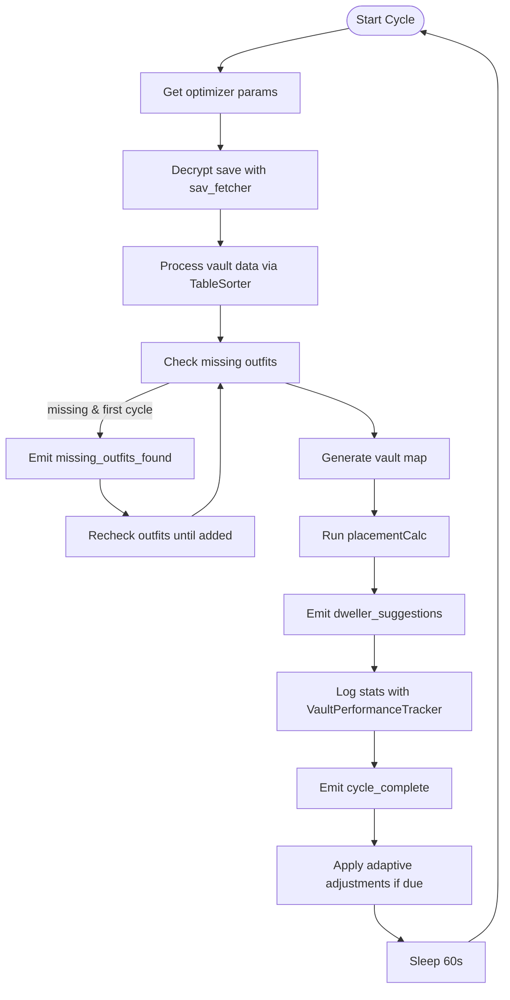
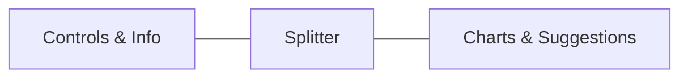

# Fallout Shelter GUI (`fallout_gui.py`)

A PySide6-based desktop interface for the **Fallout Shelter Vault Optimizer**. It lets users start/stop automated optimization cycles, view real-time performance charts, handle missing outfit data, inspect dweller assignment suggestions, and generate a final report. Core modules include multithreading for background work, Matplotlib for plotting, and GitHub-based self-update checks.

---

## ⚙️ Dependencies

This module imports core GUI and plotting libraries, plus several project-specific components:

```python
from placementCalc import NULL
from outfit_manager import OutfitDatabaseManager
from version import __version__ as APP_VERSION
import updater
```
– **placementCalc** for placement logic (provides `NULL`)  
– **outfit_manager.py** for outfit DB management   
– **version.py** exposes `APP_VERSION`   
– **updater.py** for GitHub Releases checks   

Within the optimization thread, additional modules power each step:

- **sav_fetcher.py** (decrypts save → JSON)  
- **TableSorter.py** (process vault data)  
- **virtualvaultmap.py** (ASCII vault map)  
- **placementCalc.py** (dweller/outfit assignment)  
- **VaultPerformanceTracker.py** (performance history)   
- **AdaptiveVaultOptimizer.py** (adaptive parameter tuning)   

---

## 📚 Key Classes

| Class                    | Role                                                                 |
|--------------------------|----------------------------------------------------------------------|
| **OptimizationThread**   | Runs repeated optimization cycles off the GUI thread                 |
| **ProductionBarChart**   | Bar chart widget for current-cycle room production times             |
| **PerformanceChart**     | Line chart widget plotting average production time over history     |
| **UpdateCheckThread**    | Background thread for checking and downloading application updates   |
| **FalloutShelterGUI**    | Main window: builds UI, responds to events, coordinates threads      |

---

## 🚀 OptimizationThread

A `QThread` subclass that orchestrates each optimization cycle:

```python
class OptimizationThread(QThread):
    cycle_complete = Signal(int, dict)      # cycle_number, stats
    error_occurred   = Signal(str)          # error message
    dweller_suggestions = Signal(dict)      # placementCalc output
    missing_outfits_found = Signal(list)    # list of missing outfit IDs
```

1. **Initialization**  
   Stores `vault_name`, user-provided outfits list, and a `running` flag.

2. **run()**  
   - Retrieves adaptive params via `AdaptiveVaultOptimizer`   
   - Decrypts and loads save with `sav_fetcher.run()`  
   - Processes JSON via `TableSorter.run()`  
   - Checks for missing outfits; if any on first cycle, emits `missing_outfits_found` and pauses until resolved  
   - Generates vault map via `virtualvaultmap.run()`  
   - Calls `placementCalc.run()` to compute dweller/outfit assignments  
   - Emits `dweller_suggestions` with the JSON dict  
   - Records performance via `VaultPerformanceTracker` and emits `cycle_complete`   
   - Every N cycles applies adaptive adjustments  
   - Sleeps 60 s before next iteration  

3. **stop()**  
   Sets `running=False` to safely exit the loop.

### Cycle Workflow



---

## 📊 Chart Widgets

### ProductionBarChart

Displays **room production times** (initial, before balance, after balance, with outfits) as grouped bars.

- **setup_plot()**: configures dark theme, axes labels, grid  
- **update_plot(results_file: str)**: loads JSON file, extracts times per room, and plots bars  

<details>
<summary>Sample usage</summary>

```python
chart = ProductionBarChart(parent_widget)
chart.update_plot("vault1_optimization_results.json")
```
</details>

### PerformanceChart

Plots **average production time** over historical cycles along a datetime x-axis.

- **setup_plot()**: sets title, labels, grid  
- **update_plot(vault_name: str)**: reads `<vault_name>_performance_history.json` and draws four series  

---

## 🔄 UpdateCheckThread

A simple `QThread` to query GitHub Releases:

```python
class UpdateCheckThread(QThread):
    finished_signal = Signal(dict)
    def run(self):
        result = updater.check_for_update(self.current_version, self.repo, asset_name_match=self.asset_match)
        self.finished_signal.emit(result)
```

- **finished_signal** payload:  
  ```json
  {
    "update_available": bool,
    "latest_version": "vX.Y.Z" or null,
    "downloaded_installer": "/tmp/...exe" or null,
    "error": null or string
  }
  ```

---

## 🏠 FalloutShelterGUI

The main application window, a `QMainWindow` subclass that ties everything together.

### Theme & Styling

- **apply_fallout_theme()**  
  Applies a **dark, neon-green** Fallout-inspired palette and a custom stylesheet for widgets .

### UI Structure

Built via `setup_ui()`:



#### Left Panel (Controls & Info)

- **Vault Configuration**  
  - Vault number input (`QLineEdit`)
- **Control Panel**  
  - ▶️ Start Optimization  
  - ⏹ Stop Optimization  
  - ⬆️ Check for Updates  
- **System Status**  
  - Status label, cycles completed  
  - Countdown, progress bar  
- **System Log** (`QTextEdit`)  
- **Vault-Tec Tips** (`QListWidget`) loaded via `load_fallout_tips()`

#### Right Panel (Tabbed Views)

| Tab                   | Contents                                  |
|-----------------------|-------------------------------------------|
| 📊 Performance        | Timeline (`PerformanceChart`) + Bar chart (`ProductionBarChart`) |
| 👥 Dweller Moves      | Read-only HTML suggestions (`QTextEdit`)  |
| 📈 Statistics         | Final report graphs & stats (`QTextEdit`/`QScrollArea`) |

### Event Handlers & Methods

- **load_fallout_tips()**: populates tips list with static advice  
- **log(message, color)**: timestamped, colored log entries  
- **handle_missing_outfits(ids)**: launches outfit entry dialogs via `OutfitDatabaseManager.prompt_for_missing_outfits()`  
- **start_optimization()**:  
  1. Validates vault number  
  2. Instantiates `OptimizationThread`, connects signals  
  3. Disables input, enables stop button  
  4. Starts background thread & chart timer  
- **stop_optimization()**: stops threads/timers, re-enables controls, calls `generate_final_report()`  
- **on_cycle_complete(cycle, stats)**: updates cycle count, logs completion, resets countdown  
- **start_countdown_timer()** / **update_countdown()**: progress bar countdown to next cycle  
- **on_error(msg)**: logs error and stops optimization  
- **update_suggestions(suggestions)**: reads `<vault>_optimization_results.json`, builds styled HTML report of room moves and outfit changes  
- **update_chart()**: refreshes both charts every 5 s  
- **generate_final_report()**: uses `VaultPerformanceTracker.get_summary_stats()` to display summary and per-cycle bar charts  
- **check_updates_action()** / **on_update_check_finished(result)**: handles update workflow and installer launch

---

## 🔗 Integration with Other Modules

| Module                         | Role                                                                                   |
|--------------------------------|----------------------------------------------------------------------------------------|
| sav_fetcher.py                 | Decrypts `.sav` → JSON using bundled Java source                                      |
| TableSorter.py                 | Parses vault JSON to extract dwellers, rooms, inventory, and initial outfit list       |
| virtualvaultmap.py             | Generates ASCII floor map of the vault layout                                          |
| placementCalc.py               | Core algorithm for balancing and outfit assignments                                    |
| AdaptiveVaultOptimizer.py      | Suggests dynamic parameter tweaks based on performance trends                          |
| VaultPerformanceTracker.py     | Records and plots cycle performance history                                            |
| outfit_manager.py              | SQLite database of outfit stats; prompts user to enter missing outfits                 |
| updater.py                     | Fetches GitHub release info, downloads installer, and launches update                 |

Together, these components provide a full **GUI-driven workflow**: fetch save data, optimize placement, visualize results, adapt parameters, and keep the application up to date.