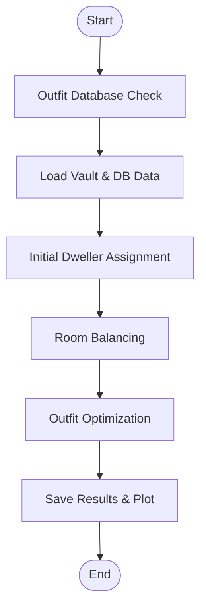

 # placementCalc.py

This module orchestrates dweller placement, room balancing, and outfit optimization to **maximize production efficiency** in a Fallout Shelter vault. It integrates data from the vault save, the outfits database, and historical performance, then outputs optimized assignments and logs detailed swap operations.

## Dependencies

This file relies on:

- Python standard libraries: `os`, `json`, `sqlite3`, `time`, `collections`, `datetime`
- Third-party packages: `numpy`, `matplotlib`
- Project modules:
  - **OutfitDatabaseManager** (from `outfit_manager.py`)
  - **VaultPerformanceTracker** (from `VaultPerformanceTracker.py`)

## Classes

### SwapLogger

Logs each dweller swap with before/after performance and stat analysis .

```python
class SwapLogger:
    """Detailed logging and analysis for each swap operation"""

    def __init__(self, vault_happiness):
        self.vault_happiness = vault_happiness
        self.swap_history = []
        self.swap_count = 0
```

Responsibilities:
- **log_swap**: Records swap details, calculates time improvement.
- **_print_swap_details**: Prints stats, room performance deltas, overall gain.
- **_calculate_improvement**: Computes total seconds saved.
- **_parse_room**: Maps room codes to stat requirements and type.
- **print_summary**: Summarizes all swaps and highlights best/worst.

### BalancingConfig

Defines priorities and thresholds for the balancing algorithm .

```python
class BalancingConfig:
    """Configuration for balancing priorities and strategies"""

    def __init__(self):
        self.room_priorities = {
            'Medbay': 1, 'Power': 2, 'Power2': 2,
            'Water': 3, 'Water2': 3, 'Food': 4, 'Food2': 4
        }
        self.balance_threshold = 5.0
        self.max_passes = 10
        self.enable_cross_stat_balancing = True
```

Key methods:
- **set_priorities(dict)**: Override room priority ordering.
- **get_priority(room_type)**: Return numeric priority (lower is higher).
- **get_sorted_room_types()**: List room types by priority ascending.

## Main Function: `run`

Entry point that loads data, assigns dwellers, balances rooms, optimizes outfits, then saves results .

```python
def run(json_path, outfitlist, vault_name, optimizer_params=None, balancing_config=None):
    ...
    return results_file
```

It executes the following stages:

1. **Outfit Database Check**  
   Ensures all `outfitlist` IDs exist in the local database.  
   - Warns and aborts if missing.

2. **Initialize Balancing Config**  
   Applies `optimizer_params` or defaults to set thresholds, passes, and strategies.

3. **Load Vault & DB Data**  
   - Reads `json_path` (vault export) from Downloads folder.  
   - Fetches current `ProductionRoom` assignments and dweller stats from `vault.db`.

4. **Parse Vault Map**  
   - Reads `vault_map.txt` layout.  
   - Compacts merged rooms and numbers duplicates.

5. **Build Initial Assignments**  
   - Classifies dwellers by primary stat (best, second, worst).  
   - Assigns top dwellers to production rooms, then fallback and worst to training rooms.

6. **Compute Production Times**  
   - Uses `get_room_production_time` with formula:  
     `pool / (total_stat * (1 + happiness))`.

7. **Balancing Phase**  
   - **Cross-Stat Balancing** (if enabled):  
     Iteratively swaps dwellers across rooms to minimize deviation from group targets.  
   - **Same-Stat Balancing**:  
     Swaps within same room group when cross-stat is disabled or complete.  
   - Logs each swap via **SwapLogger**.

8. **Outfit Optimization**  
   - Validates existing outfits against new placement.  
   - Relocates misplaced outfits.  
   - **Phase 1**: Fills stat deficits by assigning high-efficiency outfits to rooms with greatest need.  
   - **Phase 2**: Distributes remaining outfits to highest-value rooms.

9. **Results & Visualization**  
   - Recalculates times with outfits.  
   - Plots bar chart of **Initial → Balanced → With Outfits** times.  
   - Saves plot as `vault_production_<timestamp>.png`.  
   - Dumps comprehensive `optimization_results.json`.  
   - Updates the vault’s performance history via **VaultPerformanceTracker**.

---

## Constants

| Constant             | Description                              |
|----------------------|------------------------------------------|
| ROOM_CODE_MAP        | Maps room code to type (e.g. `"Geothermal"→"Power"`)  |
| ROOM_STAT_MAP        | Maps room code to relevant dweller stat |
| ROOM_GROUPS          | Groups codes into production categories |
| BASE_POOL            | Base production pools per room type     |
| SIZE_MULTIPLIER      | Multiplier for room size                 |
| ROOM_CAPACITY        | Dweller capacity per room size           |

---

## High-Level Flowchart



---

## Usage

Call from the main program or GUI thread:

```python
from placementCalc import run

results = run(
    json_path="vault1.json",
    outfitlist=["Jumpsuit", "CombatArmor", ...],
    vault_name="vault1",
    optimizer_params={'BALANCE_THRESHOLD': 8.0, 'MAX_PASSES': 15}
)
print(f"Optimization completed: {results}")
```

---

## Integration Context

- **fallShel_efficiency_program.py** invokes `placementCalc.run` per cycle.
- **fallout_gui.py** calls it on a background `QThread` and displays suggestions.
- **AdaptiveVaultOptimizer.py** tunes parameters passed into `run`.
- **VaultPerformanceTracker.py** records metrics before and after each cycle.

This documentation provides a complete guide to how `placementCalc.py` drives dweller placement and optimization within the larger Fallout Shelter efficiency toolchain.